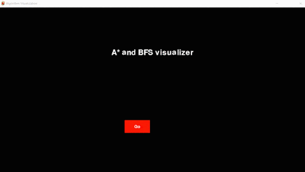
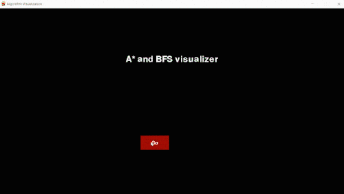

# Path Finding Algorithms Using Pygame
## Astar
A* is a graph traversal and path search algorithm, which is often used in many fields of computer science due to its completeness, optimality, and optimal efficiency. One major practical drawback is its O(b^d) space complexity, as it stores all generated nodes in memory.

## BFS

Breadth first search is a graph traversal algorithm that starts traversing the graph from root node and explores all the neighbouring nodes. Then, it selects the nearest node and explore all the unexplored nodes. The algorithm follows the same process for each of the nearest node until it finds the goal.

